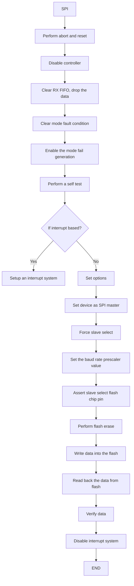

# SPI Interface

```mermaid
graph TD
    A[SPI] --> B[Perform abort and reset]
    B --> C[Disable controller]
    C --> D[Clear RX FIFO, drop the data]
    D --> E[Clear mode fault condition]
    E --> F[Enable the mode fail generation]
    F --> G[Perform a self test]
    G --> H{If interrupt based?}
    H -- Yes --> I[Setup an interrupt system]
    H -- No --> J[Set options]
    J --> K[Set device as SPI master]
    K --> L[Force slave select]
    L --> M[Set the baud rate prescaler value]
    M --> N[Assert slave select flash chip pin]
    N --> O[Perform flash erase]
    O --> P[Write data into the flash]
    P --> Q[Read back the data from flash]
    Q --> R[Verify data]
    R --> S[Disable interrupt system]
    S --> T[END]
```

