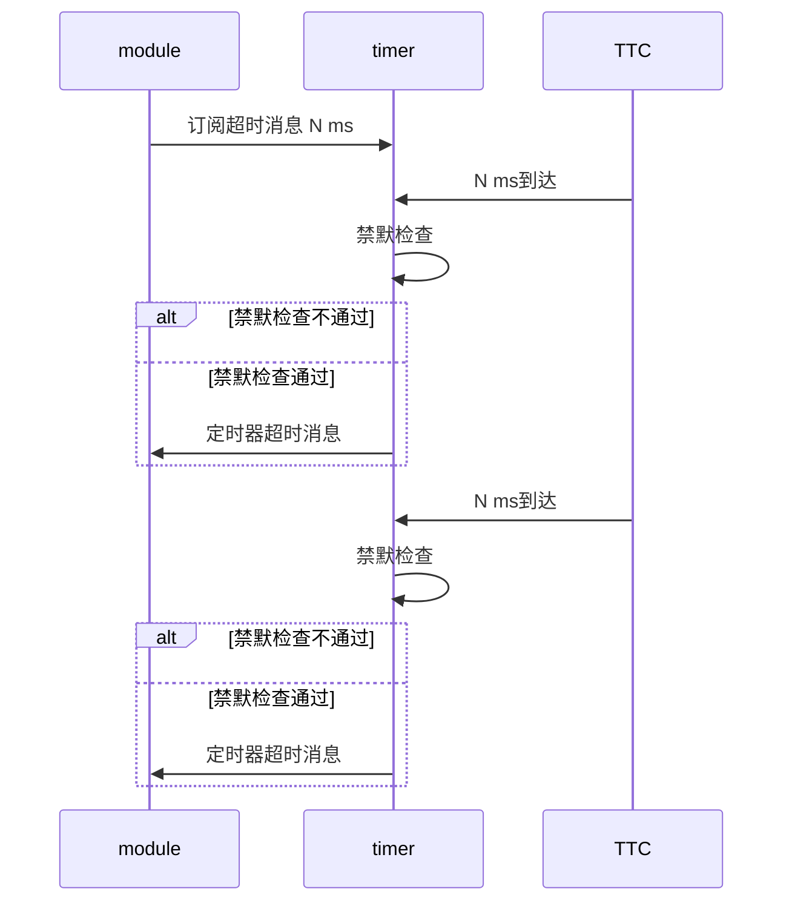

# 主控板软件设计

## 1.整体概述

## 2.框架

### 2.1 工程部署方法

步骤1 拉取工程

步骤2 清除工程，会删除上次创建的工程


清除后的工程如下所示：


**步骤2** 可选, 首次使用需要配置vitis的环境变量，具体方法，详见auto_create_vitis下的设置环境变量直接处理vitis.pdf， 如果已经配置过忽略改步骤


**步骤3**：根据需要选择对应的构建脚本，如下所示


该过程会持续1分钟左右，请耐心等待，运行关闭后观察是否有报错，正常的结束如下所示：


**步骤 4** 回到工程目录，可以看到会多出对应核的工程文件


**步骤5**：导入代码，运行import_src脚本


步骤6：使用vitis切换work_space到上述工程路径，如下所示


步骤7 配置各核工程


配置编码


**添加库，当前程序运行以来的库**，

 


**导入头文件**


至此该核工程配置完成，如果有其他核，重复步骤7，直到所有核工程配置完毕

步骤8 编译工程，编译工程有两种：

1. 使用ctrl+b 则所有的核app都会编译（所有的编译错误都解决后，使用该方法）。
2. 编译指定核的工程(解决编译错误建议使用这种方式)


### 2.2工程调试流程

对于多核工程，调试的时候需要指定启动哪些核


多核会依次下载进去，要调试哪个核就点击哪个核，调试命令同单核调试


调试时候如果断点为x号如下所示，**说明该文件不是当前核的文件，在工程目录中选择对应的核的文件加断点**


## 3.模块

### 3.1 定时器模块

定时器模块放置在timer文件夹，采用PS的TTC定时器

各核使用的资源如下所示

| 核索引 | 设备ID                  | 中断ID             |
| ------ | ----------------------- | ------------------ |
| 0      | XPAR_XTTCPS_1_DEVICE_ID | XPAR_XTTCPS_1_INTR |
| 1      | XPAR_XTTCPS_2_DEVICE_ID | XPAR_XTTCPS_2_INTR |
| 2      | XPAR_XTTCPS_3_DEVICE_ID | XPAR_XTTCPS_3_INTR |
| 3      | XPAR_XTTCPS_4_DEVICE_ID | XPAR_XTTCPS_4_INTR |

定时器为循环定时器，每过1ms产生一个中断；

定时器设计的目的是为了根据不同模块的定时诉求，产生通知消息。设计的时候采用发布订阅的方式， 订阅者需要自行注册超时通知。

一个定时器目前最大支持的订阅个数由宏定义

```c
#define WX_TIMER_SPT_SUBSCRIBER_NUM 16
```


注册时候， 模块需要提供如下信息：

- 模块ID
- 超时时间
- 是否静默超时通知的Hook，禁默检查设计的目的是为了当模块的状态不适合处理超时消息的时候，用于屏蔽超时；
- 定时器ID，由模块自定义，用于区分不同的超时

详见WX_Timer_SubcribeTimerMsg定义

```c
/* 订阅定时器超时消息
- timerPeriodMs  定时器周期，单位ms
- subscriberId 消息接收模块
- timerId  定时器ID，订阅者自定义，用于区分不同定时器
- timeoutMute    本次超时是否本次超时消息，当模块不需要处理超时消息的时候，可以提供该函数
- timeoutMuteParam 本次超时是否本次超时消息的计算入参，订阅者提供
 */
UINT32 WX_Timer_SubcribeTimerMsg(UINT32 timerPeriodMs, WxModuleId subscriberId, UINT32 timerId,
                                 WxTimeoutMute timeoutMute, VOID *timeoutMuteParam);
```


禁默函数的原型定义如下：

```c
typedef BOOL (*WxTimeoutMute)(UINT32 timerId, VOID *callDataRef);
```

- timerId   为订阅者提供的定时器ID
- callDataRef 为订阅者提供的timeoutMuteParam

当订阅者指定的时间到达到时候，定时器会调用订阅者提供的禁默函数，如果禁默函数返回禁默，则不会给订阅者发送消息，否则发送消息；

发送消息的格式定义wx_timeout_msg_intf.h中

消息大类：WX_MSG_TYPE_TIMEOUT_MSG

消息子类：无

```c
typedef struct {
    UINT32 timerId; // 为订阅者订阅时指定的ID
} WxTimeoutMsg;
```

为了防止定时器超时依次处理大量的消息，对于相同的周期的超时，在超时决策的时候进行了离散化处理。

整体交互流程如下所示：




## 常见问题及定位

