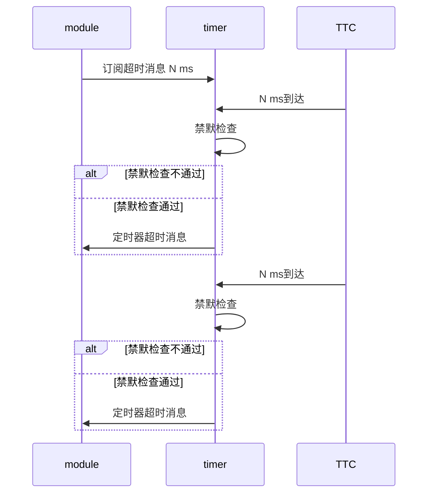

# 修订历史

| 修订人 | 修改内容 | 备注 |
| ------ | -------- | ---- |
|        |          |      |
|        |          |      |
|        |          |      |


# 术语

|      |          |      |
| ---- | -------- | ---- |
| LPD  | 低功率域 |      |
| FPD  | 高功率域 |      |
|      |          |      |


# 整体概述

# 框架

## 多核部署


其中0x64000000用于共享内存核间通信

## 工程部署方法

**步骤0** 建议关闭vitis再进行工程构建

**步骤1** 拉取工程

**步骤2** 清除工程，会删除上次创建的工程


清除后的工程如下所示：


**步骤2** 可选, 首次使用需要配置vitis的环境变量，具体方法，详见auto_create_vitis下的设置环境变量直接处理vitis.pdf， 如果已经配置过忽略改步骤


**步骤3**：根据需要选择对应的构建脚本，如下所示


该过程会持续1分钟左右，请耐心等待，运行关闭后观察是否有报错，正常的结束如下所示：


**步骤 4** 回到工程目录，可以看到会多出对应核的工程文件


**步骤5**：导入代码，运行import_src脚本


步骤6：使用vitis切换work_space到上述工程路径，如下所示


步骤7 配置各核工程


配置编码


**添加库，当前程序运行以来的库**，

 


**导入头文件**


至此该核工程配置完成，如果有其他核，重复步骤7，直到所有核工程配置完毕

步骤8 编译工程，编译工程有两种：

1. 使用ctrl+b 则所有的核app都会编译（所有的编译错误都解决后，使用该方法）。
2. 编译指定核的工程(解决编译错误建议使用这种方式)


## 工程调试流程

对于多核工程，调试的时候需要指定启动哪些核


多核会依次下载进去，要调试哪个核就点击哪个核，调试命令同单核调试


调试时候如果断点为x号如下所示，**说明该文件不是当前核的文件，在工程目录中选择对应的核的文件加断点**


# 模块

## 看门狗

### 看门狗简介

看门狗用于系统故障的检测和恢复。 看门狗定时器可以用于预防系统死锁或者死循环；正常情况我我们在看门狗定时器位计数到0之前重置定时器。如果使能了看门狗，一旦看门狗的定时器达到0，将会产生如下信号：

1. 系统复位
2. 终端
3. 或者外部信号

看门狗的超时周期和输出信号的宽度均是可编程的。


当前PS由三个系统看门口单元

- LDP_SWDT：使用SWDT 寄存器集合，也称为swdt0； 用于保护RPU MPcore和它的互联，可以用于复位RPU或者LDP
- FPD_SWDT：使用WDT寄存器集合，也称为swdt1；用于保护APU MPCore和它的互联，可以用于复位APU或者FPD
- CSU_SWDT：使用CSU_WDT 寄存器集合；用于保护CSU和PMU互联。


下图不同的颜色表示了不同功率域的颜色，我们可知4个APU核位域全功率域（FPD）， RPU位域低功率域（LPD）


- 24bit计数器
- 可变的超时周期，支持1ms到30秒的范围，使用100Mhz 时钟
- 可编程的复位周期


**使能看门狗及中断**：Zero Mode Register： 控制24bit计数器达到0的行为。一旦收到0信号

- 如果WDEN和IRQER置位则会产生一个持续一定clock数量的中断输出信号（该clock的数量由MODE IRQLEN寄存器配置）
- 如果WDEN置位，则会设置复位输出信号为1（）；

**超时周期的设置**：通过CONTROL寄存器的**CLKSET**和**CRV**位域用于设置24-bit的超时周期。

当前PS支持设置计数器的高12bit，低12bit假设为均为1，进行设置


**重启定时器**，使用Restart寄存器进行配置，当往该寄存器写入一个匹配的key时，会重新状态CRV的值到计数器

**定时器什么时候计数**？定时器计数不依赖WDEN，只要时钟源存在，24bit 计数器就会持续向0进发，当达到0的时候，会设置状态寄存区的WDZ位，zero信号会被拉高，如果不重启定时器，则计数器会一直保持0值。

看门狗在上电复位的时候会默认使能，并且从最大值开始计数，目的是防止上电后程序运行发生死锁。

调试对看门狗的影响，当掉时候我们会经常停止CPU，然后分析系统的寄存器和内存，所以增加了CPU debug信号用于连接SWDT的cpu_debug，这样调试的时候定时器不会走字了；


看门狗编程流程，详见代码

关于寄存器的使用详见官网手册

关于喂狗的时机：

1. 任务没处理完一条消息则喂狗；
2. 任务切换

IDLE任务，通过使能configUSE_IDLE_HOOK，实现：void vApplicationIdleHook( void );

```c
#if ( configUSE_IDLE_HOOK == 1 )
{
    extern void vApplicationIdleHook( void );

    /* Call the user defined function from within the idle task.  This
    allows the application designer to add background functionality
    without the overhead of a separate task.
    NOTE: vApplicationIdleHook() MUST NOT, UNDER ANY CIRCUMSTANCES,
    CALL A FUNCTION THAT MIGHT BLOCK. */
    vApplicationIdleHook();
}
#endif /* configUSE_IDLE_HOOK */
```

任务切换

```c
#if( configUSE_TICK_HOOK > 0 )
	extern void vApplicationTickHook( void ); /*lint !e526 Symbol not defined as it is an application callback. */
#endif
```


看门狗相关的API

| API                    | 说明                      | 备注                                         |
| ---------------------- | ------------------------- | -------------------------------------------- |
| XWdtPs_SetControlValue | 设置控制寄存器的值        | XWDTPS_COUNTER_RESET、XWDTPS_CCR_PSCALE_0008 |
| XWdtPs_DisableOutput   | Disable the RESET output. |                                              |
| XWdtPs_Start           | Start the Wdt device.     |                                              |
| XWdtPs_Stop            | 停止                      |                                              |
| XWdtPs_RestartWdt      | Restart the timer.        |                                              |
| XWdtPs_IsWdtExpired    | 是否超时                  |                                              |
| XWdtPs_EnableOutput    |                           | XWDTPS_IRQ_SIGNAL/XWDTPS_RESET_SIGNAL        |


### 看门狗喂狗

增加看门狗防止任务卡死，所以当前以任务级为力度进行喂狗，喂狗时机:

1. 任务处理某消息前喂狗
2. 周期性喂狗

### 看门狗超时的处理

周性检查是否该周期内所有任务狗进行了喂狗，如果喂狗了，则对看门狗定时器进行重置，以免其超时，如果举例上次喂狗，某任务始终没有喂狗，则认为该任务出现了死循环，停止打印日志，并显示当前各核各任务的喂狗情况，如下所示：


hungry 字段显示了狗儿饥饿的时间，超过阈值的位卡死的任务，其中任务0-表示主任务；1-表示驱动任务；

msg核submsg显示了该任务最后一次处理的消息；

可选（复位操作），咱不支持；


## 定时器模块

定时器模块放置在timer文件夹，采用PS的TTC定时器

各核使用的资源如下所示

| 核索引 | 设备ID                  | 中断ID             |
| ------ | ----------------------- | ------------------ |
| 0      | XPAR_XTTCPS_1_DEVICE_ID | XPAR_XTTCPS_1_INTR |
| 1      | XPAR_XTTCPS_2_DEVICE_ID | XPAR_XTTCPS_2_INTR |
| 2      | XPAR_XTTCPS_3_DEVICE_ID | XPAR_XTTCPS_3_INTR |
| 3      | XPAR_XTTCPS_4_DEVICE_ID | XPAR_XTTCPS_4_INTR |

定时器为循环定时器，每过1ms产生一个中断；

定时器设计的目的是为了根据不同模块的定时诉求，产生通知消息。设计的时候采用发布订阅的方式， 订阅者需要自行注册超时通知。

一个定时器目前最大支持的订阅个数由宏定义

```c
#define WX_TIMER_SPT_HANDLE_NUM 16
```


注册时候， 模块需要提供如下信息：

- 模块ID
- 超时时间
- 是否静默超时通知的Hook，禁默检查设计的目的是为了当模块的状态不适合处理超时消息的时候，用于屏蔽超时；
- 定时器ID，由模块自定义，用于区分不同的超时

详见WX_Timer_SubcribeTimerMsg定义

```c
/* 订阅定时器超时消息
- timerPeriodMs  定时器周期，单位ms
- subscriberId 消息接收模块
- timerId  定时器ID，订阅者自定义，用于区分不同定时器
- timeoutMute    本次超时是否本次超时消息，当模块不需要处理超时消息的时候，可以提供该函数
- timeoutCallBackRef 本次超时是否本次超时消息的计算入参，订阅者提供
 */
UINT32 WX_Timer_SubcribeTimerMsg(UINT32 timerPeriodMs, WxModuleId subscriberId, UINT32 timerId,
                                 WxTimeoutCallBack timeoutMute, VOID *timeoutCallBackRef);
```


禁默函数的原型定义如下：

```c
typedef BOOL (*WxTimeoutCallBack)(UINT32 timerId, VOID *callDataRef);
```

- timerId   为订阅者提供的定时器ID
- callDataRef 为订阅者提供的timeoutMuteParam

当订阅者指定的时间到达到时候，定时器会调用订阅者提供的禁默函数，如果禁默函数返回禁默，则不会给订阅者发送消息，否则发送消息；

发送消息的格式定义wx_timeout_msg_intf.h中

消息大类：WX_MSG_TYPE_TIMEOUT_MSG

消息子类：无

```c
typedef struct {
    UINT32 timerId; // 为订阅者订阅时指定的ID
} WxTimeoutMsg;
```

为了防止定时器超时依次处理大量的消息，对于相同的周期的超时，在超时决策的时候进行了离散化处理。

整体交互流程如下所示：



## 中断控制器


| API                            | 说明         |      |
| ------------------------------ | ------------ | ---- |
| XScuGic_LookupConfig           |              |      |
| XScuGic_CfgInitialize          |              |      |
| XScuGic_GetPriorityTriggerType | 获取触发方式 |      |
| XScuGic_SetPriorityTriggerType |              |      |
| Xil_ExceptionRegisterHandler   |              |      |
| Xil_ExceptionRegisterHandler   |              |      |
| XScuGic_Connect                |              |      |
| XScuGic_Disconnect             |              |      |
| XScuGic_Enable                 |              |      |
| Xil_ExceptionEnable            |              |      |
|                                |              |      |


## 日志

日志模块负责打印日志

日志的级别划分如下，按先后顺序进行优先级

| 日志级别 | 取值 | 使用场景                                                     | 备注     |
| -------- | ---- | ------------------------------------------------------------ | -------- |
| Debug    | 0    | 用于记录代码运行相关信息以及内部状态，eg: 打印内部的变量信息，进入了某个函数 | 默认关闭 |
| Warning  | 1    | 需要引起注意事件，比如队列的消息数量快达到阈值               | 默认关闭 |
| Critical | 2    | 无法忍受的错误， 需要立即介入定位                            | 默认开启 |
| Notice   | 3    | 关键信息，系统启动，系统重启，模块部署信息                   | 默认开启 |


每种级别打印，日志模块均提供对应的API接口, 我们可以使用类似于print的函数进行日志打印，日志打印结束会**自动添加回车**。

| 日志级别 | API                   |      |
| -------- | --------------------- | ---- |
| Debug    | wx_debug(fmt, ...)    |      |
| Warning  | wx_warning(fmt, ...)  |      |
| Critical | wx_critical(fmt, ...) |      |
| Notice   | wx_notice(fmt, ...)   |      |

在使用日志api前必须遵循如下原则：

1. 在.c文件的开头定义宏指定日志ID，如果不定义日志ID，则无法使用日志打印函数，日志ID宏定义如下：

   ```c
   #define WX_MODULE_LOG_ID WX_LOG_ID_XXX    //
   ```

    其中 **WX_LOG_ID_XXX** 在枚举中WxLogId定义，建议一个模块的所有.c统一使用一个，最多支持64种

2. 头文件中不准许使用日志打印功能


设备启动后，默认只显示级别为Critical即以上的日志均会输出，我们可以通过调试命令调整默认输出的日志界别，命令格式如下：

```c
dbgcmd board 0 core x set log level <level>;
```

其中x为核索引，eg: 想让核0只显示notice界别的日志

```shell
dbgcmd board 0 core 0 set log level 3;
```

可以通过调试命令使能或禁止某模块打印日志默认级别以下的日志，其命令格式如下：

```c
dbgcmd board 0 core x set log on/off <logid ...>
```

如果不指定log id则表示所有模块

日志的打印格式如下：


# 调试命令

调试命令的使用方法如下

```shell
dbgcmd board <boardID> core <core-idx> cmd ...;
```

其中 boardID 表示板号，目前

- 0 - 表示主控板
- 其他咱不支持

core-idx表示查询的核索引，目前支持的取值为0-3

举例说明：我想查询主控板核0的计数器，即执行如下命令：

```shell
dbgcmd board 0 core 0 show cnt;
```

执行结果如下所示：

```shell
Command(dbgcmd board 0 core 0 show evtmsg) execute result =
------------------------
msg-name                                         msg-type         malloc-cnt       free-cnt         used-num        
WX_MSG_TYPE_DEBUG_REQ                            3                1                0                1               
WX_MSG_TYPE_CAMREA_REQ                           16               742              742              0               
WX_MSG_TYPE_INIT_ORIENTATION_REQ                 18               742              742              0               
WX_MSG_TYPE_FEED_DOG_REQ                         23               26               26               0               
--- End
Command(dbgcmd board 0 core 0 show cnt) execute result =
------------------------

Normal CNT INFOS
----------------
CntId                                                            CntValue
WX_EVT_MSG_ALLOC_NUM                                             82442
WX_EVT_MSG_FREE_NUM                                              82441
WX_CAMERA_ZX_INTR_CNT                                            41207
WX_CAMER_SEND_CAMERA_DATA_2_INIT_ORI_NUM                         41207

Exceptional CNT INFOS
---------------------
CntId                                                            CntValue

FailCode CNT INFOS
-------------
FailCode                                                         CntValue
--- End
```


## 主控板调试命令

| 命令                                                         | 说明                                                         | 参数说明                                                     |
| ------------------------------------------------------------ | ------------------------------------------------------------ | ------------------------------------------------------------ |
| dbgcmd board 0 core x show cnt;                              | 查询核x计数器                                                | NA                                                           |
| dbgcmd board 0 core x show evtmsg;                           | 查询核x事件消息的申请和释放的次数                            | NA                                                           |
| dbgcmd board 0 core x set log on [logid1 logid2 ...];        | 设置核x使能某模块的日志，如果不指定id，则所有模块均使能打印  | logid - 为模块的日志id，详见代码实现                         |
| dbgcmd board 0 core x set log off [logid1 logid2 ...];       | 设置核x关闭所有模块或者指定模块的日志，如果不指定id，则所有模块均停止打印 | logid - 为模块的日志id，详见代码实现                         |
| dbgcmd board 0 core 0 set camera threshold <value>；         | 设置相机阈值                                                 | value : 0~255                                                |
| dbgcmd board 0 core 0 set hdmiout  <on>/<off>;               | 是否打开HDMI显示                                             | NA                                                           |
| dbgcmd board 0 core 0 set camera resolution <width> <height>; | 设置相机分辨率的宽和高                                       | 目前仅支持<br /><1280><1024><br /><512><512><br /><256><256><br /><128><128> |
| dbgcmd board 0 core 0 set camera PGmode <on>/<off>;          | 设置相机测试图模式的开启和关闭                               | NA                                                           |
| dbgcmd board 0 core 0 set camera PGmode <value>;             | 设置测试图模式的生成图案                                     | value : 0~8                                                  |
| dbgcmd board 0 core 0 set camera reset;                      | 设置相机复位                                                 | NA                                                           |
| dbgcmd board 0 core 0 set camera exposuretime <value>;       | 设置相机曝光时间                                             | 和实际的分辨率大小有关，最小为24，最大为行数-1               |
| dbgcmd board 0 core 0 set camera bitdepth <value>;           | 设置相机位深                                                 | 仅支持8bit、10bit、12bit                                     |
| dbgcmd board 0 core 0 set camera gain <value>;               | 设置相机增益                                                 | value : 0~420                                                |


# 常见问题及定位

