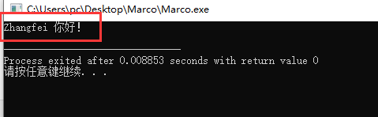
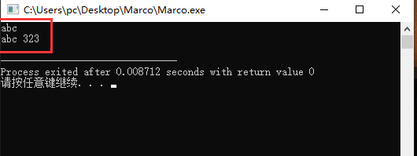
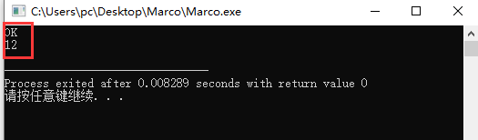

# C 语言中 void* 详解及应用

void 无类型

void “无类型指针”、

## void 的作用

1. 对函数返回值的限定：当函数不需要返回值时，必须要使用void限定。 void func (int a, char *b)
2. 对函数参数的限定：当函数不允许接受参数时，必须使用void限定。int func(void)

## void 指针的使用规则

1. void 指针可以指向任意类型的数据，就是说可以用任意类型的指针对 void 指针对 void 指针赋值。例如：

```c
int *a；
void *p；
p=a；
```

如果要将 void 指针 p 赋给其他类型的指针，则需要强制类型转换，就本例而言：**a=（int \*）p**。在内存的分配中我们可以见到 void 指针使用：内存分配函数 malloc 函数返回的指针就是 **void \*** 型，用户在使用这个指针的时候，要进行强制类型转换，也就是显式说明该指针指向的内存中是存放的什么类型的数据 **(int \*)malloc(1024)** 表示强制规定 malloc 返回的 void* 指针指向的内存中存放的是一个个的 int 型数据。

2. 在 ANSI C 标准中，不允许对 void 指针进行一些算术运算如 p++ 或 p+=1 等，因为既然 void 是无类型，那么每次算术运算我们就不知道该操作几个字节，例如 char 型操作 sizeof(char) 字节，而 int 则要操作 sizeof(int) 字节。而在 GNU 中则允许，因为在默认情况下，GNU 认为 **void \*** 和 **char \*** 一样，既然是确定的，当然可以进行一些算术操作，在这里**sizeof(\*p)==sizeof(char)**。

void 几乎只有"注释"和限制程序的作用，因为从来没有人会定义一个 void 变量，让我们试着来定义：

```c
void a;
```

这行语句编译时会出错，提示**"illegal use of type 'void'"**。即使 **void a** 的编译不会出错，它也没有任何实际意义。

众所周知，如果指针 p1 和 p2 的类型相同，那么我们可以直接在 p1 和 p2 间互相赋值；如果 p1 和 p2 指向不同的数据类型，则必须使用强制类型转换运算符把赋值运算符右边的指针类型转换为左边指针的类型。

```c
float *p1;
int *p2;
p1 = p2;
//其中p1 = p2语句会编译出错，
//提示“'=' : cannot convert from 'int *' to 'float *'”，必须改为：
p1 = (float *)p2;
```

而 **void \*** 则不同，任何类型的指针都可以直接赋值给它，无需进行强制类型转换。

```c
void *p1;
int *p2;
p1 = p2;
```

但这并不意味着，**void \*** 也可以无需强制类型转换地赋给其它类型的指针。因为"无类型"可以包容"有类型"，而"有类型"则不能包容"无类型"。

小心使用 void 指针类型:

按照 ANSI(American National Standards Institute) 标准，不能对 void 指针进行算法操作，即下列操作都是不合法的：

```c
void * pvoid;
pvoid++; //ANSI：错误
pvoid += 1; //ANSI：错误
//ANSI标准之所以这样认定，是因为它坚持：进行算法操作的指针必须是确定知道其指向数据类型大小的。
//例如：
int *pint;
pint++; //ANSI：正确
```

pint++ 的结果是使其增大 sizeof(int)。

但是 GNU 则不这么认定，它指定 **void \*** 的算法操作与 **char \*** 一致。因此下列语句在 GNU 编译器中皆正确：

```c
pvoid++; //GNU：正确
pvoid += 1; //GNU：正确
```

pvoid++ 的执行结果是其增大了 1。

在实际的程序设计中，为迎合 ANSI 标准，并提高程序的可移植性，我们可以这样编写实现同样功能的代码：

```c
void * pvoid;
((char *)pvoid)++; //ANSI：错误；GNU：正确
(char *)pvoid += 1; //ANSI：错误；GNU：正确
```

GNU 和 ANSI 还有一些区别，总体而言，GNU 较 ANSI 更"开放"，提供了对更多语法的支持。但是我们在真实设计时，还是应该尽可能地迎合 ANSI 标准。 如果函数的参数可以是任意类型指针，那么应声明其参数为**void \***。

**注：**void 指针可以任意类型的数据，可以在程序中给我们带来一些好处，函数中形为指针类型时，我们可以将其定义为 void 指针，这样函数就可以接受任意类型的指针。如：

典型的如内存操作函数 memcpy 和 memset 的函数原型分别为：

```c
void * memcpy(void *dest, const void *src, size_t len);
void * memset ( void * buffer, int c, size_t num );
```

这样，任何类型的指针都可以传入 memcpy 和 memset 中，这也真实地体现了内存操作函数的意义，因为它操作的对象仅仅是一片内存，而不论这片内存是什么类型（[参见 C 语言实现泛型编程](https://www.runoob.com/w3cnote/c-general-function.html)）。如果 memcpy 和 memset 的参数类型不是 **void \***，而是 **char \***，那才叫真的奇怪了！这样的 memcpy 和 memset 明显不是一个"纯粹的，脱离低级趣味的"函数！void 的出现只是为了一种抽象的需要，如果你正确地理解了面向对象中"抽象基类"的概念，也很容易理解 void 数据类型。正如不能给抽象基类定义一个实例，我们也不能定义一个 void（让我们类比的称 void 为"抽象数据类型"）变量。


# C语言之宏的使用技巧

## 宏定义常见形式

```c
#define 宏名	替代文本 // 替代文本可以是列表，也可以为空（即什么都没有，仅此声明宏名而已）
#define GOOD 		 // 空宏
```

1. 空的宏的作用是预留下以后平台移植时的其它选项的定义，是为了移植的方便。
2. 跟条件编译一起用：`#define GOOD ; #ifdef GOOD`


`eg1`：当替代文本为空，常用于条件编译：

```c++
#define DEBUG		// 替代文本：空
...
#ifdef DEBUG
...
#ifndef DEBUG
...
```


## 宏命名规则

1. 宏的名字中不允许有空格，必须遵循C变量的命名规则（只能使用字母、数字、下划线），一般习惯大写；
2. 空宏在预编译时被替换成空字符串；
3. 宏定义中可以包含其他宏，即嵌套宏；
4. 预处理部分不是C语言的定义语句，所以宏定义完成之后是不带分号(😉的

## 宏的作用域

由`#define`的作用域从文件中的的定义点开始，直到用`#undef`指令取消宏为止或者直到文件尾为止（由二者中最先满足的那个结束宏的作用域）。


## 宏的作用

1. 很大程度上是为了提高代码的可移植性
2. 增强代码的可读性，例如利用宏定义常量：`#define PI 3.14159`
3. 做函数功能无法完成的功能（也称之为母函数）


## 宏的几点注意

1. 不要在宏中使用增量和减量运算符，容易产生副作用（后述案例分析）；
2. 为防止歧义，替代列表中的参数要用括号括起来；
3. 替代列表最外层用括号括起来，整体使用，防止替代后出现歧义（出现因运算优先级和结合性等歧义问题）；
4. 带参宏的标识符与左括号之间间不能有空格，否则会被认定为无参数宏；
5. 宏定义中使用 =
6. 宏定义中的末尾使用分号结尾

```c
#define MAX(x,y) ((x) > (y) ? （x）: (y)) 	     // 替换列表，参数用括号括起来
#define IS_EVEN(n) ((n) % 2 == 0)		     // 判断偶数
```


## 宏的运算符

### \

名称：宏延续符：也称之为宏的换行符；

作用：当定义的宏不能用一行表达完整时，可以用`\`表示下一行继续此宏的定义。

注意：换行不能切断单词，只能在空格的地方进行。

范例分析：编译器：`gnu C++ DevC++5.1.5`

```c++
// 为了偏于阅读，采用小写范式宏命名，工程项目开发强烈建议：大写
#include <iostream>
#include <stdio.h>
#include <string.h>
// 换行\
#define NAME "Zhang"  \
			   "fei"  \
			  " 你好！"

int main(int argc, char **argv) {
     // 范例1
    std::cout << NAME << std::endl;
    
	return 0;
}
```



### #

名称：字符串化运算符；

作用：将宏定义中的传入参数名转换成用一对双引号括起来参数名字符串；

范围：能用于有传入参数的宏定义中，且必须置于宏定义体中的参数名前；

范例分析：编译器：`gnu C++ DevC++5.1.5`

```c++
// 为了偏于阅读，采用小写范式宏命名
#include <iostream>
#include <stdio.h>
#include <string.h>

// 宏定义
#define example( instr ) #instr  		// instr 前后都有空格，最终都预处理时忽略掉

int main(int argc, char **argv) {
    // 范例1
    string str1 = example( abc );
    std::cout << str1 << std::endl;
    
    // 范例2
    string str2 = example( abc  323 );	// abc和123之间有2个空格
    std::cout << str2 << std::endl;
    
    return 0;
}
```



运行结果分析：对空格的处理

1. 忽略传入参数名前面和后面的空格；
2. 当传入参数名间存在空格时，编译器将会自动连接各个子字符串，用每个子字符串中只以一个空格连接，忽略其中多余一个的空格。

### ##

名称：记号粘贴运算符，也称之为连接符；

作用：将宏定义的多个形参名连接成一个实际参数名；

范围：只能用于有传入参数的宏定义中，且必须置于宏定义体中的参数名前；

范例分析：编译器：`gnu C++ DevC++5.1.5`

```c++
#define fffA "OK"
#define f(a) fff ## a 		// ## 连接符
#define g(a) ggg ## a 		// ## 作为参数名

#include <stdio.h>
int main()
{
    // 范例1
    printf("%s\n", f(A))
    
    // 范例2 
    int g(a) = 12;		    // 定义int参数名
    printf("%d\n",g(a));
    return 0;
}
```



运行结果分析：对空格的处理

1. 当用##连接形参时，##前后的空格可有可无;
2. 连接后的实际参数名，必须为实际存在的参数名或是编译器已知的宏定义名

## #@

名称：字符化运算符

作用：将传入的单字符参数名转换成字符，以一对单引用括起来。

范围：只能用于有传入参数的宏定义中，且必须置于宏定义体中的参数名前。

注意：只能在Microsoft 的VC编译专用，而gnu官方的g++编译器并不认可；

范例分析：编译器：`VS2019`

```c++
#include <iostream>
#include <stdio.h>

#define ToChar(x) #@ x

int main()
{
    // 范例1
    char foo = 'a';
    std::cout << foo << std::endl;
    
    // 范例2
    foo = ToChar(F);
    std::cout << foo << std::endl;
	return 0;
}
```

运行结果：


运行结果分析：对空格的处理

1. 当用#@连接形参时，#@之后的空格可有可无;
2. 形参只能#@符的后面；

## 无参数的宏


